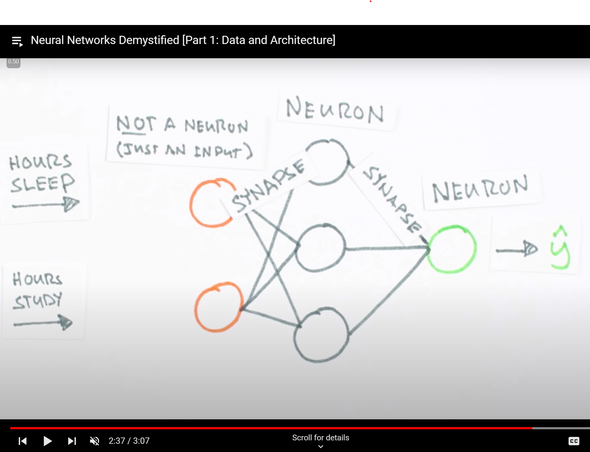

# Sample Exam Questions and Answers

## Question 1
Describe the data mining decision making process (20m)
a.	Why is evaluation necessary in the decision making process? (5)

## Question 2
	‘The benefits of AI outweigh the limitations’. Do you agree with this statement? Discuss and justify with reference to examples of benefits and limitations. (25m)

### Answer

The advantages of AI indisputably surpass its limitations. AI has emerged as a transformative force across industries, revolutionizing healthcare, enhancing productivity, and fostering innovation.

In healthcare, AI facilitates early disease detection through advanced diagnostics, enabling more effective and personalized treatments. For example, machine learning algorithms analyze medical images swiftly and accurately, significantly improving patient outcomes.

In various industries, AI optimizes processes, driving efficiency and cost-effectiveness. Autonomous systems powered by AI, such as self-driving cars, promise safer transportation, reducing accidents caused by human error.

While some concerns exist, such as biases in AI systems, ongoing efforts are actively addressing these issues. Transparency and fairness initiatives aim to mitigate biases in AI algorithms, ensuring equitable decision-making. Moreover, strides are being made to develop more explainable AI models, enhancing trust and understanding of their decision-making processes.

The argument of job displacement due to automation is countered by the creation of new job opportunities. AI not only replaces mundane tasks but also opens avenues for high-skilled positions, stimulating economic growth and innovation.

Policies and regulations are being formulated to guide the ethical use of AI, ensuring responsible deployment and minimizing potential risks. The commitment to ethical AI practices aligns with the collective goal of harnessing AI's immense potential while safeguarding against misuse.

In conclusion, the myriad benefits of AI, from improved healthcare to increased efficiency across industries, outweigh its limitations. With continued innovation and responsible governance, AI holds the promise of a brighter, more advanced future for humanity.

## Question 3. 

a.	Describe the disadvantages to Natural Language Processing applications (15m)
b.	Discuss potential solutions to the ethical considerations (10m)

4.	Describe data preprocessing steps with the use of a labelled diagram. Explain each step (25)

5.	
a.	Data preprocessing is a necessary part of data mining. Why? Justify your answer (15m)
b.	What should an organisation take into consideration in the early stages of data preprocessing? Why is this a consideration? (10m)

6.	
a.	What is the relationship between statistics and data analytics? (10m)
b.	What are the main differences between descriptive and inferential statistics? (10m)

7.	
a.	Describe linear regression with the use of a labelled diagram (10m)
b.	Write an example equation to denote linear regression (10m)
c.	Explain this equation (5m)

8.	
a.	Linearity is an assumption in linear regression. What is linearity and why is it important? (10m)
b.	Multicolinearity is an assumption in linear regression. What is it and why is it important? (10m)
c.	Would you test to see if your model violates assumptions? Why? (5m)

9.	Explain the CRISP-DM process with the use of a labelled diagram. (20m)
a.	What is the application of CRISP-DM? (5m)

10.	Explain the SEMMA process with the use of a labelled diagram. (20m)
a.	What is the application of SEMMA? (5m)

11.	The following factors are considered in classification. Describe each factor.
a.	Predictive accuracy (5m)
b.	Speed (5m)
c.	Robustness (5m)
d.	Scalability (5m)
e.	Interpretability (5m)

12.	Describe a confusion matrix with the use of a labelled diagram. Describe how it is used. (25m)

13.	
a.	Describe K-means with the use of a labelled diagram (15m)
b.	What is the initialization step and why is it important? (10m)

14.	Discuss modern applications of robotics and data mining’s relevancy to their development (25m). Provide examples in your answer.

15.	Is data mining using data scraped from social media an ethical concern? Discuss both sides of this argument and provide real-life examples in your answer (25m)

## Extra Questions

### Question
Draw a ANN (Artificial Neral Network) and label and Explain the diagram.

#### Answer

This diagram illustrates an Artificial Neural Network (ANN). The leftmost circles represent input nodes conveying data to interconnected neurons via weighted connections (edges). Within the network, these inputs are multiplied by respective weights, summed up along with a bias term, and processed by an activation function within each neuron. The resulting output, typically between 0 and 1, emerges from the network.